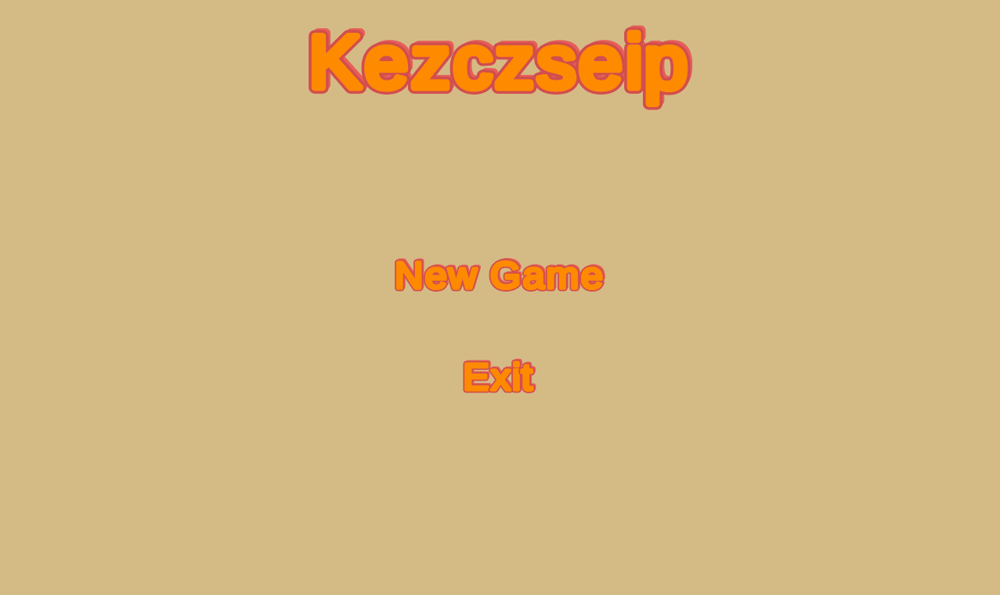

# Go 3d

Mobile game of go but with 3d cube board. Functionalities:
- saving game
- undo button
- custom board size

In android build there is a touchscreen controls
In example build ("Build 1.0"), there are mouse controlls:
- press mouse wheel for camera rotation
- scroll mouse wheel for zoom
- put pawn in field using left mouse button

Footage of windows build:
